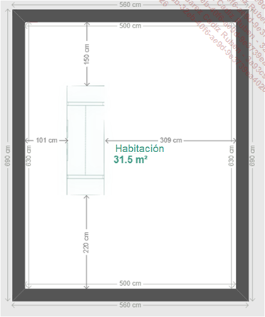
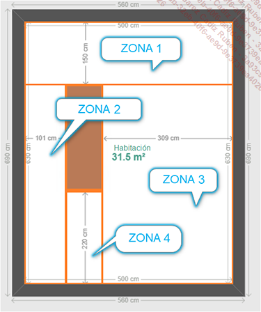

# Programación Paralela y Distribuida: Roomba.
## Repositorio.
- Link: https://github.com/mgonzalz/ppd_roomba.git
- Usuario: @mgonzalz

El repositorio contiene el archivo `main.py` que ejecuta el programa. La carpeta `modulos` alberga: `classZona.py` contiene las clases usadas para la realización del ejercicio, en este caso se tratan de *Zona* y *Objeto*; `utils.py` las funciones del programa, como pueden ser la agregación de una habitación u objeto, entre otras. Dentro de `UML` se encuentra un archivo *.drawio* con el UML diseñado, y este mismo también en formato png. Por último, el archivo `requirements` incluye las bibliotecas junto con sus respectivas versiones utilizadas.

## Enunciado.
Le proponemos realizar un proyecto que consiste en la escritura de un script Python que permite a un robot aspirador calcular la superficie de una habitación y estimar el tiempo de limpieza.

Imaginemos que la habitación que hay que limpiar contiene un mueble debajo del cual no puede meterse el robot y que tiene las siguientes características:

Una de las formas posibles de calcular la superficie que debe limpiar el robot consiste en fragmentar la superficie total en zonas utilizables:

| Zona | Largo (cm) | Ancho (cm) |
|------|------------|------------|
| 1    | 500        | 150        |
| 2    | 480        | 101        |
| 3    | 309        | 480        |
| 4    | 90         | 220        |

Una vez fragmentada, es fácil calcular la superficie total que hay que limpiar añadiendo las superficies de cada zona. Estas superficies se calculan multiplicando el largo por el ancho en cada una de ellas.

